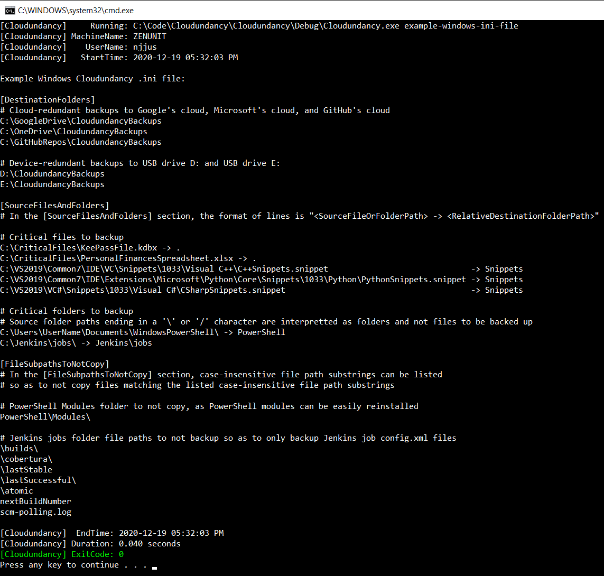

# Cloudundancy

[](https://en.wikipedia.org/wiki/C%2B%2B17) [](https://opensource.org/licenses/MIT)

Cloudundancy quickly copies files and folders to multiple destination folders to achieve cloud-redundant and device-redundant backups of key files. For example, destination folders can be configured in a Cloudundancy.ini file to be a Google Drive folder, a Microsoft OneDrive folder, and two USB drives to achieve cloud-redundant and device-redundant backups of key files.

|Build Type|Build Status|
|----------|------------|
|Travis CI Linux (Clang 7.0.0 and GCC 7.5.0)|<a href="https://travis-ci.org/NeilJustice/Cloudundancy"></a>|
|AppVeyor Windows (Visual Studio 2019 x64)|<a href="https://ci.appveyor.com/project/NeilJustice/Cloudundancy"></a>|
|Code Coverage For The GCC 7.5.0 Release Build|[](https://codecov.io/gh/NeilJustice/Cloudundancy)|

Cloudundancy is rigorously unit tested with <a href="https://github.com/NeilJustice/ZenUnitAndMetalMock">ZenUnit and MetalMock</a>.

* [Command Line Usage](#command-line-usage)
* [Cloudundancy Program Modes](#cloudundancy-program-modes)
   * [example-linux-ini-file](#print-example-linux-ini-file)
   * [example-windows-ini-file](#print-example-windows-ini-file)
   * [backup-files-to-multiple-folders](#backup-files-to-multiple-folders)
   * [backup-files-and-folders-to-7z-file](#backup-files-and-folders-to-7z-file)
* [Linux Jenkins Jobs Which Compile, clang-tidy, AddressSanitize, UndefinedBehaviorSanitize, and ThreadSanitize Cloudundancy](#linux-jenkins-jobs-which-compile-clang-tidy-addresssanitize-undefinedbehaviorsanitize-and-threadsanitize-cloudundancy)
* [Windows Jenkins Jobs Which Compile Cloudundancy](#windows-jenkins-jobs-which-compile-cloudundancy)
* [4 Commands To Build And Install Cloudundancy On Linux](#4-commands-to-build-and-install-cloudundancy-on-linux)
* [4 Commands To Build And Install Cloudundancy On Windows](#4-commands-to-build-and-install-cloudundancy-on-windows)
* [Cloudundancy Features Roadmap](#cloudundancy-features-roadmap)

## Command Line Usage

```
Cloudundancy v0.9.0 - Makes cloud-redundant and device-redundant file backups
https://github.com/NeilJustice/Cloudundancy

Usage:
   Cloudundancy print-example-linux-ini-file
   Cloudundancy print-example-windows-ini-file
   Cloudundancy backup-files-to-multiple-folders --ini-file=<CloudundancyIniFilePath> [--delete-destination-folders-first]
   Cloudundancy backup-files-and-folders-to-7z-file
      --ini-file=<CloudundancyIniFilePath>
      --7z-ini-file=<CloudundancyIniFilePath>
      --backup-staging-folder=<FolderPath>
```

Cloudundancy command line arguments are parsed using the excellent single-header library [docopt.cpp](https://github.com/docopt/docopt.cpp):


## Cloudundancy Program Modes

### print-example-linux-ini-file

12/02/2020: Work in progress.

### print-example-windows-ini-file

Cloudundancy program mode `print-example-windows-ini-file` prints an example Windows Cloudundancy .ini file for showing how to achieve data security peace of mind by way of quintuple backups of critical files and folders to three clouds (Google Drive, OneDrive, GitHub) and two USB drives (D: and E:).



`print-example-windows-ini-file` in text format:

```
[DestinationFolders]
# Cloud-redundant backups to Google's cloud, Microsoft's cloud, and GitHub's cloud
C:\GoogleDrive\CloudundancyBackups
C:\OneDrive\CloudundancyBackups
C:\GitHubRepos\CloudundancyBackups

# Device-redundant backups to USB drive D: and USB drive E:
D:\CloudundancyBackups
E:\CloudundancyBackups

[SourceFilesAndFolders]
# In the [SourceFilesAndFolders] section, the format of lines is "<SourceFileOrFolderPath> -> <RelativeDestinationFolderPath>"

# Critical files to backup
C:\CriticalFiles\KeePassFile.kdbx -> .
C:\CriticalFiles\PersonalFinancesSpreadsheet.xlsx -> .
C:\VS2019\Common7\IDE\VC\Snippets\1033\Visual C++\C++Snippets.snippet                              -> Snippets
C:\VS2019\Common7\IDE\Extensions\Microsoft\Python\Core\Snippets\1033\Python\PythonSnippets.snippet -> Snippets
C:\VS2019\VC#\Snippets\1033\Visual C#\CSharpSnippets.snippet                                       -> Snippets

# Critical folders to backup
# Source folder paths ending in a '\' or '/' character are interpretted as folders and not files to be backed up
C:\Users\UserName\Documents\WindowsPowerShell\ -> PowerShell
C:\Jenkins\jobs\ -> Jenkins\jobs

[FileSubpathsToNotCopy]
# In the [FileSubpathsToNotCopy] section, case-insensitive file path substrings
# can be listed so as to not back up files matching the listed case-insensitive file path substrings

# PowerShell Modules folder to not backup as PowerShell modules can be easily reinstalled
PowerShell\Modules\

# Jenkins jobs folder file paths to not backup so as to only backup Jenkins job config.xml files
\builds\
\cobertura\
\lastStable
\lastSuccessful\
\atomic
nextBuildNumber
scm-polling.log
```

### backup-files-to-multiple-folders

12/02/2020: Work in progress.

### backup-files-and-folders-to-7z-file

12/02/2020: Work in progress.

### Linux Jenkins Jobs Which Compile, clang-tidy, AddressSanitize, UndefinedBehaviorSanitize, and ThreadSanitize Cloudundancy

A Jenkins Blue Ocean build pipeline builds the following Cloudundancy Jenkins jobs on Fedora 33:

12/02/2020: Work in progress.

### Windows Jenkins Jobs Which Compile Cloudundancy

A Jenkins Blue Ocean build pipeline builds the following Cloudundancy Jenkins jobs on Windows 10:


## 4 Commands To Build And Install Cloudundancy On Linux

```
git clone https://github.com/NeilJustice/Cloudundancy
cd Cloudundancy && mkdir Release && cd Release
CXX=clang++ cmake .. -DCMAKE_BUILD_TYPE=Release
sudo cmake --build . --target install
```

## 4 Commands To Build And Install Cloudundancy On Windows

```
git clone https://github.com/NeilJustice/Cloudundancy
cd Cloudundancy
cmake . -G"Visual Studio 16 2019" -A x64 -DCMAKE_INSTALL_PREFIX=C:\bin
cmake --build . --config Release --target install
```

## Cloudundancy Features Roadmap

|Prioritized List Of Future Cloudundancy Features As Of 11/16/2020|
|-----------------------------------------------------------------|
|`backup-files-and-folders-to-7z-file` working on Linux|
|SonarCloud static analysis badge|
|Coverity static analysis badge|
|Parallel copying to multiple destination folders|
