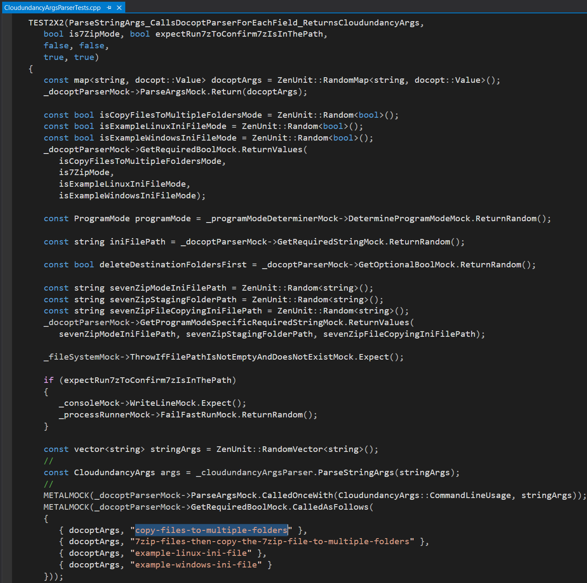

# ☁️ Cloudundancy ☁️

[](https://en.wikipedia.org/wiki/C%2B%2B20)  

Cloudundancy is a C++ command line program which quickly copies a configurable list of files and folders to a configurable list of destination folders to achieve cloud-redundant and device-redundant backups of business-critical files.

For example, in a Cloudundancy.ini file, destination folders can be configured to be a Google Drive folder, a Microsoft OneDrive folder, and two USB drives to achieve quadruple backups of business-critical files to two clouds and two USB drives.

On Windows, Google Drive and Microsoft OneDrive folders automatically upload their contents to their respective clouds.

On Linux, command line invocations of Google Drive and Microsoft OneDrive command line utilities would have to be added after the invocation of Cloudundancy to upload Cloudundancy-copied files to Google's cloud and Microsoft's cloud.

|Cloudundancy Build Type|Build Status|
|----------|------------|
|Travis CI Linux (Clang 7.0.0 and GCC 7.5.0)|<a href="https://travis-ci.org/NeilJustice/Cloudundancy"></a>|
|AppVeyor Windows (Visual Studio 2019 x64)|<a href="https://ci.appveyor.com/project/NeilJustice/Cloudundancy"></a>|
|Code Coverage For The GCC 7.5.0 Release Build|[](https://codecov.io/gh/NeilJustice/Cloudundancy)|

The correctness of Cloudundancy at the unit level is rigorously confirmed using C++ unit testing framework ZenUnit and C++ mocking framework MetalMock. <a href="https://github.com/NeilJustice/ZenUnitAndMetalMock">GitHub page for ZenUnit and MetalMock</a>.

The correctness of Cloudundancy at the user level is currently confirmed with manual testing and twice-daily Jenkins jobs which invoke Cloudundancy to backup my business-critical files. In the future Cloudundancy's correctness at the user level will be additionally confirmed using an automated acceptance testing framework.

* [Command Line Usage](#command-line-usage)
* [Cloudundancy Program Modes](#cloudundancy-program-modes)
   * [copy-files-to-multiple-folders](#copy-files-to-multiple-folders)
   * [7zip-files-then-copy-the-7zip-file-to-multiple-folders](#7zip-files-then-copy-the-7zip-file-to-multiple-folders)
   * [example-linux-ini-file](#example-linux-ini-file)
   * [example-windows-ini-file](#example-windows-ini-file)
* [Linux Jenkins Jobs Which Build, clang-tidy, AddressSanitize, and UndefinedBehaviorSanitize Cloudundancy](#linux-jenkins-jobs-which-build-clang-tidy-addresssanitize-undefinedbehaviorsanitize-cloudundancy)
* [Windows Jenkins Jobs Which Build Cloudundancy](#windows-jenkins-jobs-which-build-cloudundancy)
* [What Cloudundancy Source Code Looks Like In Visual Studio Code](#what-cloudundancy-source-code-looks-like-in-visual-studio-code)
* [What Cloudundancy Source Code Looks Like In Visual Studio 2019](#what-cloudundancy-source-code-looks-like-in-visual-studio-2019)
* [How To Build Cloudundancy From Source On Linux](#how-to-build-cloudundancy-from-source-on-linux)
* [How To Build Cloudundancy From Source On Windows](#how-to-build-cloudundancy-from-source-on-windows)
* [Cloudundancy Features Roadmap](#cloudundancy-features-roadmap)

## Command Line Usage

```
Cloudundancy v0.9.2
Copies a list of files and folders to a list of destination folders,
which could be Google Drive and Microsoft OneDrive automatic cloud-uploading folders.
https://github.com/NeilJustice/Cloudundancy

Usage:
   Cloudundancy copy-files-to-multiple-folders --ini-file=<CloudundancyIniFilePath> [--delete-destination-folders-first]
   Cloudundancy 7zip-files-then-copy-the-7zip-file-to-multiple-folders
      --ini-file-to-copy-files-to-7zip-staging-folder=<CloudundancyIniFilePath>
      --7zip-staging-folder=<FolderPath>
      --ini-file-to-copy-7zip-file-from-staging-folder-to-multiple-folders=<CloudundancyIniFilePath>
   Cloudundancy example-linux-ini-file
   Cloudundancy example-windows-ini-file
```

Cloudundancy command line arguments are parsed using the excellent single-header library [docopt.cpp](https://github.com/docopt/docopt.cpp) in file `CloudundancyArgsParser.cpp`:


The correctness of `class CloudundancyArgsParser` is confirmed in file `CloudundancyArgsParserTests.cpp` using ZenUnit and MetalMock. Shown in this screenshot is the syntax for a ZenUnit 2-by-2 value parameterized test and the syntax for how to expect and assert function calls on MetalMock mock objects:



## Cloudundancy Program Modes

### copy-files-to-multiple-folders

```
Cloudundancy copy-files-to-multiple-folders --ini-file=<CloudundancyIniFilePath> [--delete-destination-folders-first]
```

Cloudundancy program mode `copy-files-to-multiple-folders` copies files and folders listed in a Cloudundancy.ini file to multiple destination folders, which could be automatic cloud-uploading Google Drive and Microsoft OneDrive folders.

As an example, imagine you had the following folder structure at `C:\CloudundancyTesting`:


With `Cloudundancy.ini` being as follows to instruct Cloudundancy to backup business-critical files and folders present in `C:\CloudundancyTesting`, except for file paths containing case-insensitive substrings `ignored_filename` or `.ignored_file_extension`:


`Cloudundancy.ini` in text format:

```ini
[DestinationFolders]
C:\CloudundancyTesting\GoogleDrive
C:\CloudundancyTesting\OneDrive

[SourceFilesAndFolders]
C:\CloudundancyTesting\BusinessCriticalFile1.txt -> .
C:\CloudundancyTesting\BusinessCriticalFile2.txt -> .
C:\CloudundancyTesting\BusinessCriticalFile3.txt -> .
C:\CloudundancyTesting\BusinessCriticalFolder1\  -> BusinessCriticalFolder1
C:\CloudundancyTesting\BusinessCriticalFolder2\  -> BusinessCriticalFolder2
C:\CloudundancyTesting\BusinessCriticalFolder3\  -> RenamedBusinessCriticalFolder3

[FileSubpathsToNotCopy]
ignored_filename
.ignored_file_extension
```

Here is what happens when the following Cloudundancy command line run to achieve cloud-redundant backups of business-critical files to folders `C:\CloudundancyTesting\GoogleDrive` and `C:\CloudundancyTesting\OneDrive`:

`Cloudundancy.exe copy-files-to-multiple-folders --ini-file=C:\CloudundancyTesting\Cloudundancy.ini --delete-destination-folders-first`:


Resulting contents of `C:\CloudundancyTesting\GoogleDrive`:


Resulting contents of `C:\CloudundancyTesting\GoogleDrive\Cloudundancy.log`:


Resulting contents of `C:\CloudundancyTesting\OneDrive`:


Resulting contents of `C:\CloudundancyTesting\OneDrive\Cloudundancy.log`:


Now should your Google account or Microsoft account ever be compromised, peace of mind can be had by knowing you made a cloud-redundant backup with the help of Cloudundancy.

### 7zip-files-then-copy-the-7zip-file-to-multiple-folders

```
Cloudundancy 7zip-files-then-copy-the-7zip-file-to-multiple-folders
      --ini-file-to-copy-files-to-7zip-staging-folder=<CloudundancyIniFilePath>
      --7zip-staging-folder=<FolderPath>
      --ini-file-to-copy-7zip-file-from-staging-folder-to-multiple-folders=<CloudundancyIniFilePath>
```

Program mode `7zip-files-then-copy-the-7zip-file-to-multiple-folders` performs the following steps to backup files to a .7z file and then copy the .7z file to multiple destination folders:

1. Deletes the "7-Zip staging folder" specified with `--7zip-staging-folder`. Example `--7zip-staging-folder`: `C:\Cloudundancy7ZipTesting\7ZipStagingFolder`.
2. Copies `[SourceFilesAndFolders]` listed in Cloudundancy.ini file `--ini-file-to-copy-files-to-7zip-staging-folder` to the 7-Zip staging folder specified as the sole directory in the `[DestinationDirectories]` section of this Cloudundancy.ini file.

Example `--ini-file-to-copy-files-to-7zip-staging-folder`:


3. Runs executable `7z` (Binary `7z` on the PATH on Linux, `7z.exe` on the PATH on Windows) to 7-Zip the contents of `--7zip-staging-folder` to a .7z file written to folder `<7ZipStagingFolder>\7ZipFile` with file name `CloudundancyBackup_YYYY-MM-DDTHH-MM-SS`. Example .7z file name: `CloudundancyBackup_2020-12-21T15-01-03.7z`
4. Copies the `.7z` file to `[DestinationFolders]` listed in Cloudundancy.ini file `--ini-file-to-copy-7zip-file-from-staging-folder-to-multiple-folders`.

Example `--ini-file-to-copy-7zip-file-from-staging-folder-to-multiple-folders`:


As an example, imagine you had the following folder structure and were interested in achieving 7-Zipped cloud-redundant backups for folder `C:\Cloudundancy7ZipTesting\CodeFolder`, which contains all of your GitHub repos as subfolders.


Here is what happens when the following Cloudundancy command line is run:

```
Cloudundancy.exe 7zip-files-then-copy-the-7zip-file-to-multiple-folders
   --ini-file-to-copy-files-to-7zip-staging-folder=C:\Cloudundancy7ZipTesting\CodeFolderTo7ZipStagingFolderCopyingStep.ini
   --7zip-staging-folder=C:\Cloudundancy7ZipTesting\7ZipStagingFolder
   --ini-file-to-copy-7zip-file-from-staging-folder-to-multiple-folders=C:\Cloudundancy7ZipTesting\7ZipFileToGoogleDriveAndOneDriveCopyingStep.ini
```


GitHub repos successfully 7-Zipped and copied to a Google Drive folder:


GitHub repos successfully 7-Zipped and copied to a OneDrive folder:


### example-linux-ini-file

Work in progress.

### example-windows-ini-file

Cloudundancy program mode `example-windows-ini-file` prints an example Windows Cloudundancy .ini file which shows how to achieve quintuple backups of business-critical files to two auto-cloud-uploading folders (Google Drive and Microsoft OneDrive), one folder which requires `git add/commit/push` to reach its corresponding cloud (GitHub), and two USB drives (D: and E:).

`example-windows-ini-file` console output:


`example-windows-ini-file` in text format:

```ini
[DestinationFolders]
# Cloud-redundant backups to Google's cloud, Microsoft's cloud, and GitHub's cloud
C:\GoogleDrive\CloudundancyBackups
C:\OneDrive\CloudundancyBackups
C:\GitHubRepos\CloudundancyBackups

# Device-redundant backups to USB drive D: and USB drive E:
D:\CloudundancyBackups
E:\CloudundancyBackups

[SourceFilesAndFolders]
# In the [SourceFilesAndFolders] section, the format of lines is "<SourceFileOrFolderPath> -> <RelativeDestinationFolderPath>"

# Critical files to backup
C:\CriticalFiles\KeePassFile.kdbx -> .
C:\CriticalFiles\PersonalFinancesSpreadsheet.xlsx -> .
C:\VS2019\Common7\IDE\VC\Snippets\1033\Visual C++\C++Snippets.snippet                              -> Snippets
C:\VS2019\Common7\IDE\Extensions\Microsoft\Python\Core\Snippets\1033\Python\PythonSnippets.snippet -> Snippets
C:\VS2019\VC#\Snippets\1033\Visual C#\CSharpSnippets.snippet                                       -> Snippets

# Critical folders to backup
# Source folder paths ending in a '\' or '/' character are interpretted as folders and not files to be backed up
C:\Users\UserName\Documents\WindowsPowerShell\ -> PowerShell
C:\Jenkins\jobs\ -> Jenkins\jobs

[FileSubpathsToNotCopy]
# In the [FileSubpathsToNotCopy] section, case-insensitive file path substrings can be listed
# so as to not copy files matching the listed case-insensitive file path substrings

# PowerShell Modules folder to not copy, as PowerShell modules can be easily reinstalled
PowerShell\Modules\

# Jenkins jobs folder file paths to not backup so as to only backup Jenkins job config.xml files
\builds\
\cobertura\
\lastStable
\lastSuccessful\
\atomic
nextBuildNumber
scm-polling.log
```

### Linux Jenkins Jobs Which Build, clang-tidy, AddressSanitize, and UndefinedBehaviorSanitize Cloudundancy

A Jenkins Blue Ocean build pipeline builds the following Cloudundancy Jenkins jobs on Fedora 33 with Clang and GCC:

### Windows Jenkins Jobs Which Build Cloudundancy

A Jenkins Blue Ocean build pipeline builds the following Cloudundancy Jenkins jobs on Windows 10 with Visual Studio 2019:


## What Cloudundancy Looks Like In Visual Studio Code


## What Cloudundancy Source Code Looks Like In Visual Studio 2019


## How To Build Cloudundancy From Source On Linux

```bash
git clone https://github.com/NeilJustice/Cloudundancy
cd Cloudundancy && mkdir Release && cd Release
CXX=clang++ cmake .. -DCMAKE_BUILD_TYPE=Release
sudo cmake --build . --target install
```

Resulting `/usr/local/bin/cloudundancy`:

## How To Build Cloudundancy From Source On Windows

```powershell
git clone https://github.com/NeilJustice/Cloudundancy
cd Cloudundancy
cmake . -G"Visual Studio 16 2019" -A x64 -DCMAKE_INSTALL_PREFIX=C:\bin
cmake --build . --config Release --target install
```

Resulting `C:\bin\Cloudundancy.exe`:


## Cloudundancy Features Roadmap

|Future Cloudundancy Feature|Estimated Delivery Month|Implementation Status|
|---------------------------|--------------|---------------------|
|`7zip-files-then-copy-the-7zip-file-to-multiple-folders` working on Linux|December 2020|In progress|
|SonarCloud static analysis badge|January 2021|Awaiting implementation|
|Coverity static analysis badge|January 2021|Awaiting implementation|
|`--parallel` for parallel file copying to multiple destination folders|April 2021|Awaiting implementation|
