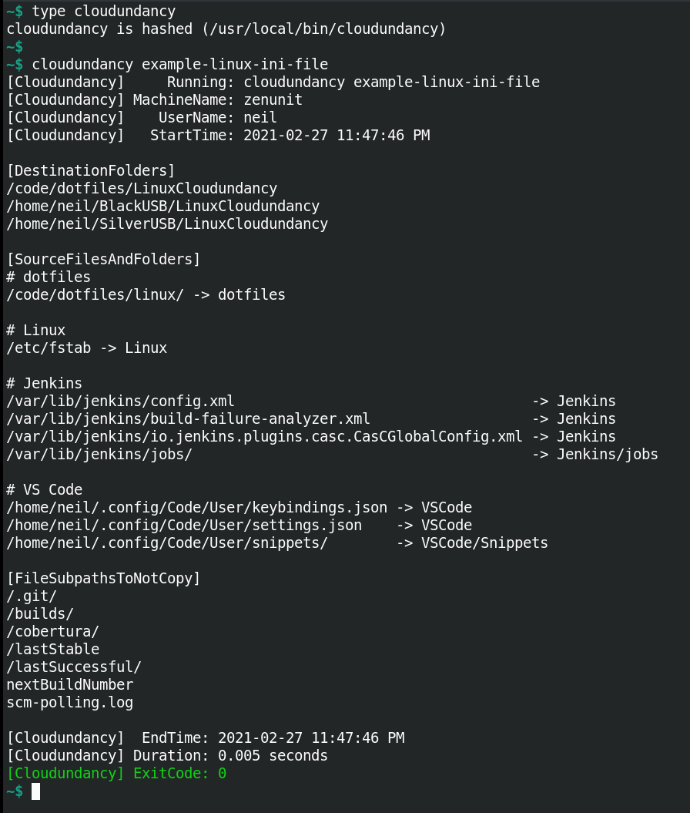
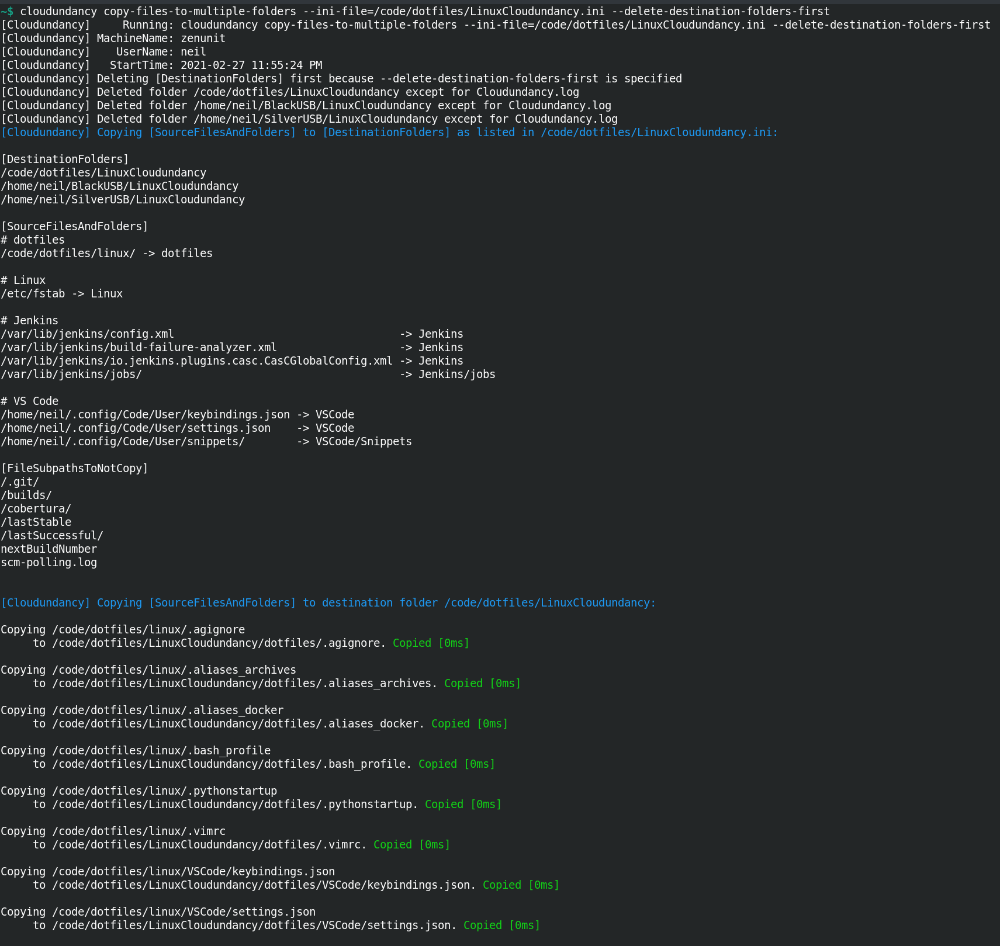
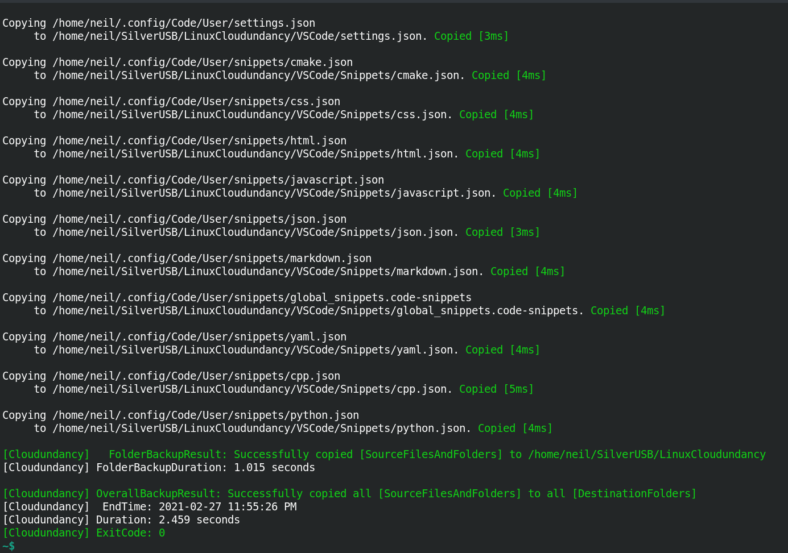
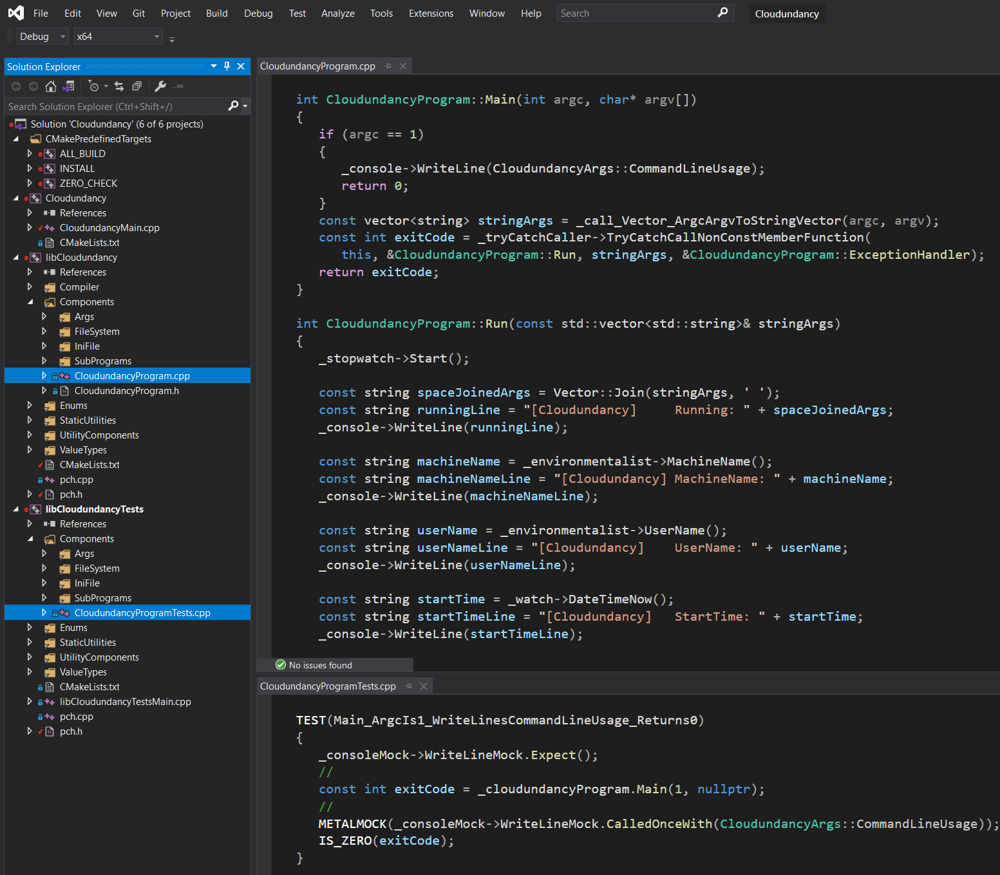

# ☁️ Cloudundancy ☁️

[](https://en.wikipedia.org/wiki/C%2B%2B20)  

Cloudundancy is a cross-platform C++ command line program for quickly copying a configurable list of files and folders to a configurable list of destination folders to achieve cloud-redundant and device-redundant backups of files.

For example, in a Cloudundancy.ini file, destination folders can be configured to be automatic cloud-uploading Google Drive and Microsoft OneDrive folders plus two USB drives to achieve cloud-redundant and device-redundant backups of business-critical files.

|Build Type|Build Status|
|----------|------------|
|Travis CI Linux Clang 9.0.1 and Linux GCC 9.3.0 Debug and Release|[](https://travis-ci.com/NeilJustice/Cloudundancy)|
|AppVeyor Windows Visual Studio 2019 x64 Debug and Release|<a href="https://ci.appveyor.com/project/NeilJustice/Cloudundancy"></a>|
|Code coverage for the Travis CI Linux GCC 9.3.0 Release Build|[](https://codecov.io/gh/NeilJustice/Cloudundancy)|

Cloudundancy is rigorously unit tested with <a href="https://github.com/NeilJustice/ZenUnitAndMetalMock">ZenUnit and MetalMock</a>.

* [Cloudundancy Command Line Usage](#cloudundancy-command-line-usage)
* [Cloudundancy Program Modes](#cloudundancy-program-modes)
   * [example-linux-ini-file](#example-linux-ini-file)
   * [example-windows-ini-file](#example-windows-ini-file)
   * [copy-files-to-multiple-folders](#copy-files-to-multiple-folders)
   * [7zip-files-then-copy-the-7zip-file-to-multiple-folders](#7zip-files-then-copy-the-7zip-file-to-multiple-folders)
* [Cloudundancy Code Structure As It Appears In Visual Studio Code](#cloudundancy-code-structure-as-it-appears-in-visual-studio-code)
* [Cloudundancy Code Structure As It Appears In Visual Studio 2019](#cloudundancy-code-structure-as-it-appears-in-visual-studio-2019)
* [Linux Jenkins Jobs Which Build, clang-tidy, Cppcheck, AddressSanitize, and UndefinedBehaviorSanitize Cloudundancy](#linux-jenkins-jobs-which-build-clang-tidy-cppcheck-addresssanitize-and-undefinedbehaviorsanitize-cloudundancy)
* [Windows Jenkins Jobs Which Build Cloudundancy And SonarQube Scan Cloudundancy's Python Code](#windows-jenkins-jobs-which-build-cloudundancy-and-sonarqube-scan-cloudundancys-python-code)
* [How To Build Binary cloudundancy From Source On Linux With Clang](#how-to-build-binary-cloudundancy-from-source-on-linux-with-clang)
* [How To Build Executable Cloudundancy.exe From Source On Windows with Visual Studio 2019](#how-to-build-executable-cloudundancy.exe-from-source-on-windows-with-visual-studio-2019)
* [Cloudundancy Roadmap](#future-features-roadmap)

## Cloudundancy Command Line Usage

```
Cloudundancy v0.9.2 - Creates cloud-redundant and device-redundant file backups
https://github.com/NeilJustice/Cloudundancy

Usage:
   cloudundancy example-linux-ini-file
   cloudundancy example-windows-ini-file
   cloudundancy copy-files-to-multiple-folders
      --ini-file=<CloudundancyIniFilePath>
      [--delete-destination-folders-first]
   cloudundancy 7zip-files-then-copy-the-7zip-file-to-multiple-folders
      --ini-file-to-copy-files-to-7zip-staging-folder=<CloudundancyIniFilePath>
      --7zip-staging-folder=<FolderPath>
      --ini-file-to-copy-7zip-file-from-staging-folder-to-multiple-folders=<CloudundancyIniFilePath>
```

Cloudundancy command line arguments are parsed in file `CloudundancyArgsParser.cpp` using the excellent single-header library [docopt.cpp](https://github.com/docopt/docopt.cpp):


## Cloudundancy Program Modes

### example-linux-ini-file

Cloudundancy program mode `example-linux-ini-file` prints an example Linux Cloudundancy .ini file which shows how to achieve triple backups of files to one GitHub repo folder and two USB drives.

```ini
[DestinationFolders]
/code/dotfiles/LinuxCloudundancy
/home/neil/BlackUSB/LinuxCloudundancy
/home/neil/SilverUSB/LinuxCloudundancy

[SourceFilesAndFolders]
# dotfiles
/code/dotfiles/linux/ -> dotfiles

# Linux
/etc/fstab -> Linux

# Jenkins
/var/lib/jenkins/config.xml                                   -> Jenkins
/var/lib/jenkins/build-failure-analyzer.xml                   -> Jenkins
/var/lib/jenkins/io.jenkins.plugins.casc.CasCGlobalConfig.xml -> Jenkins
/var/lib/jenkins/jobs/                                        -> Jenkins/jobs

# VS Code
/home/neil/.config/Code/User/keybindings.json -> VSCode
/home/neil/.config/Code/User/settings.json    -> VSCode
/home/neil/.config/Code/User/snippets/        -> VSCode/Snippets

[FileSubpathsToNotCopy]
/.git/
/builds/
/cobertura/
/lastStable
/lastSuccessful/
nextBuildNumber
scm-polling.log
```



### example-windows-ini-file

Cloudundancy program mode `example-windows-ini-file` prints an example Windows Cloudundancy .ini file which shows how to achieve quintuple backups of files to two automatic cloud-uploading folders (C:\GoogleDrive and C:\OneDrive), one GitHub repo folder (C:\GitHubRepos), and two USB drives (D: and E:).

```ini
[DestinationFolders]
# Cloud-redundant backups to Google's cloud, Microsoft's cloud, and GitHub's cloud
C:\GoogleDrive\CloudundancyBackups
C:\OneDrive\CloudundancyBackups
C:\GitHubRepos\CloudundancyBackups

# Device-redundant backups to USB drive D: and USB drive E:
D:\CloudundancyBackups
E:\CloudundancyBackups

[SourceFilesAndFolders]
# In the [SourceFilesAndFolders] section, the format of lines is "<SourceFileOrFolderPath> -> <RelativeDestinationFolderPath>"

# Critical files to backup
C:\CriticalFiles\KeePassFile.kdbx -> .
C:\CriticalFiles\PersonalFinancesSpreadsheet.xlsx -> .
C:\VS2019\Common7\IDE\VC\Snippets\1033\Visual C++\C++Snippets.snippet                              -> Snippets
C:\VS2019\Common7\IDE\Extensions\Microsoft\Python\Core\Snippets\1033\Python\PythonSnippets.snippet -> Snippets
C:\VS2019\VC#\Snippets\1033\Visual C#\CSharpSnippets.snippet                                       -> Snippets

# Critical folders to backup
# Source folder paths ending in a '\' or '/' character are interpretted as folders and not files to be backed up
C:\Users\UserName\Documents\WindowsPowerShell\ -> PowerShell
C:\Jenkins\jobs\ -> Jenkins\jobs

[FileSubpathsToNotCopy]
# In the [FileSubpathsToNotCopy] section, case-insensitive file path substrings can be listed
# so as to not copy files matching the listed case-insensitive file path substrings

# PowerShell Modules folder to not copy, as PowerShell modules can be easily reinstalled
PowerShell\Modules\

# Jenkins jobs folder file paths to not backup so as to only backup Jenkins job config.xml files
\builds\
\cobertura\
\lastStable
\lastSuccessful\
\atomic
nextBuildNumber
scm-polling.log
```


### copy-files-to-multiple-folders

```
Cloudundancy copy-files-to-multiple-folders --ini-file=<CloudundancyIniFilePath> [--delete-destination-folders-first]
```

Cloudundancy program mode `copy-files-to-multiple-folders` copies files and folders listed in a Cloudundancy.ini file to multiple destination folders, which most notably can be automatic cloud-uploading Google Drive and Microsoft OneDrive folders on Windows for achieving cloud-redundant file backups, or multiple USB drive directories for achieving device-redundant file backups.

`copy-files-to-multiple-folders` console output on Linux:





As an example on Windows, imagine the following folder structure at `C:\CloudundancyTesting`:


With `Cloudundancy.ini` being as follows to instruct Cloudundancy to backup business-critical files and folders present in `C:\CloudundancyTesting`, except for file paths containing case-insensitive substrings `ignored_filename` or `.ignored_file_extension`:


`Cloudundancy.ini` in text format:

```ini
[DestinationFolders]
C:\CloudundancyTesting\GoogleDrive
C:\CloudundancyTesting\OneDrive

[SourceFilesAndFolders]
C:\CloudundancyTesting\BusinessCriticalFile1.txt -> .
C:\CloudundancyTesting\BusinessCriticalFile2.txt -> .
C:\CloudundancyTesting\BusinessCriticalFile3.txt -> .
C:\CloudundancyTesting\BusinessCriticalFolder1\  -> BusinessCriticalFolder1
C:\CloudundancyTesting\BusinessCriticalFolder2\  -> BusinessCriticalFolder2
C:\CloudundancyTesting\BusinessCriticalFolder3\  -> RenamedBusinessCriticalFolder3

[FileSubpathsToNotCopy]
ignored_filename
.ignored_file_extension
```

Here is the console output when the following Cloudundancy command line is run to achieve cloud-redundant backups of business-critical files to folders `C:\CloudundancyTesting\GoogleDrive` and `C:\CloudundancyTesting\OneDrive`:

`Cloudundancy.exe copy-files-to-multiple-folders --ini-file=C:\CloudundancyTesting\Cloudundancy.ini --delete-destination-folders-first`:


Resulting contents of `C:\CloudundancyTesting\GoogleDrive`:


Resulting contents of `C:\CloudundancyTesting\OneDrive`:


Resulting contents of `C:\CloudundancyTesting\GoogleDrive\Cloudundancy.log`:


Resulting contents of `C:\CloudundancyTesting\OneDrive\Cloudundancy.log`:


Now one day should access to your Google account or Microsoft account become not possible by way of a variety of rare but possible potential scenarios, peace of mind can be had by knowing you have cloud-redundant backups of your files made with the help of Cloudundancy.

### 7zip-files-then-copy-the-7zip-file-to-multiple-folders

```
Cloudundancy 7zip-files-then-copy-the-7zip-file-to-multiple-folders
      --ini-file-to-copy-files-to-7zip-staging-folder=<CloudundancyIniFilePath>
      --7zip-staging-folder=<FolderPath>
      --ini-file-to-copy-7zip-file-from-staging-folder-to-multiple-folders=<CloudundancyIniFilePath>
```

Program mode `7zip-files-then-copy-the-7zip-file-to-multiple-folders` performs the following steps to backup files to a .7z file and then copy the .7z file to multiple destination folders:

1. Deletes the "7-Zip staging folder" specified with `--7zip-staging-folder`. Example `--7zip-staging-folder`: `C:\Cloudundancy7ZipTesting\7ZipStagingFolder`.
2. Copies `[SourceFilesAndFolders]` listed in Cloudundancy.ini file `--ini-file-to-copy-files-to-7zip-staging-folder` to the 7-Zip staging folder specified as the sole directory in the `[DestinationDirectories]` section of this Cloudundancy.ini file.

Example `--ini-file-to-copy-files-to-7zip-staging-folder`:


3. Runs executable `7z` (Binary `7z` on the PATH on Linux, `7z.exe` on the PATH on Windows) to 7-Zip the contents of `--7zip-staging-folder` to a .7z file written to folder `<7ZipStagingFolder>\7ZipFile` with file name `CloudundancyBackup_YYYY-MM-DDTHH-MM-SS`. Example .7z file name: `CloudundancyBackup_2020-12-21T15-01-03.7z`
4. Copies the `.7z` file to `[DestinationFolders]` listed in Cloudundancy.ini file `--ini-file-to-copy-7zip-file-from-staging-folder-to-multiple-folders`.

Example `--ini-file-to-copy-7zip-file-from-staging-folder-to-multiple-folders`:


As an example, imagine you had the following folder structure and were interested in achieving 7-Zipped cloud-redundant backups for folder `C:\Cloudundancy7ZipTesting\CodeFolder`, which contains all of your GitHub repos as subfolders.


Here is what happens when the following Cloudundancy command line is run:

```
Cloudundancy.exe 7zip-files-then-copy-the-7zip-file-to-multiple-folders
   --ini-file-to-copy-files-to-7zip-staging-folder=C:\Cloudundancy7ZipTesting\CodeFolderTo7ZipStagingFolderCopyingStep.ini
   --7zip-staging-folder=C:\Cloudundancy7ZipTesting\7ZipStagingFolder
   --ini-file-to-copy-7zip-file-from-staging-folder-to-multiple-folders=C:\Cloudundancy7ZipTesting\7ZipFileToGoogleDriveAndOneDriveCopyingStep.ini
```


GitHub repos successfully 7-Zipped and copied to a Google Drive folder:


GitHub repos successfully 7-Zipped and copied to a OneDrive folder:


## Cloudundancy Code Structure As It Appears In Visual Studio Code

Seen in this screenshot is the call to `_cloudundancyIniFileReader->ReadIniFile(iniFilePath`) for reading the Cloudundancy .ini file:


## Cloudundancy Code Structure As It Appears In Visual Studio 2019

Seen in this screenshot is the `CloudundancyProgram::Main(int argc, char* argv[])` function which begins Cloudundancy's program behavior:



## Linux Jenkins jobs Which Build, clang-tidy, Cppcheck, AddressSanitize, and UndefinedBehaviorSanitize Cloudundancy

A Jenkins Blue Ocean build pipeline builds the following Cloudundancy Jenkins jobs on Fedora 33:


## Windows Jenkins Jobs Which Build Cloudundancy And SonarQube Scan Cloudundancy's Python Code

A Jenkins Blue Ocean build pipeline builds the following Cloudundancy Jenkins jobs on Windows 10:


## How To Build Binary cloudundancy From Source On Linux With Clang

```bash
git clone https://github.com/NeilJustice/Cloudundancy
cd Cloudundancy && mkdir Release && cd Release
CXX=clang++ cmake .. -DCMAKE_BUILD_TYPE=Release
sudo cmake --build . --target install
```

Resulting binary `/usr/local/bin/cloudundancy`:


## How To Build Executable Cloudundancy.exe From Source On Windows With Visual Studio 2019

```powershell
git clone https://github.com/NeilJustice/Cloudundancy
cd Cloudundancy
cmake . -G"Visual Studio 16 2019" -A x64 -DCMAKE_INSTALL_PREFIX=C:\bin
cmake --build . --config Release --target install
```

Resulting executable `C:\bin\Cloudundancy.exe`:


## Cloudundancy Roadmap

|Future Cloudundancy Feature|Implementation Status As Of 3/15/2021|
|---------------------------|-------------------------------------|
|GitHub Actions build|Awaiting implementation|
|SonarCloud badge for CloudundancyPyUtils Python code|Awaiting implementation|
|SonarCloud badge for Cloudundancy C++ code|Awaiting implementation|
|Coverity C++ static analysis badge|Awaiting implementation|
|`--parallel` for parallel file copying to multiple destination folders|Awaiting implementation|
|Automated acceptance testing|Awaiting implementation|
