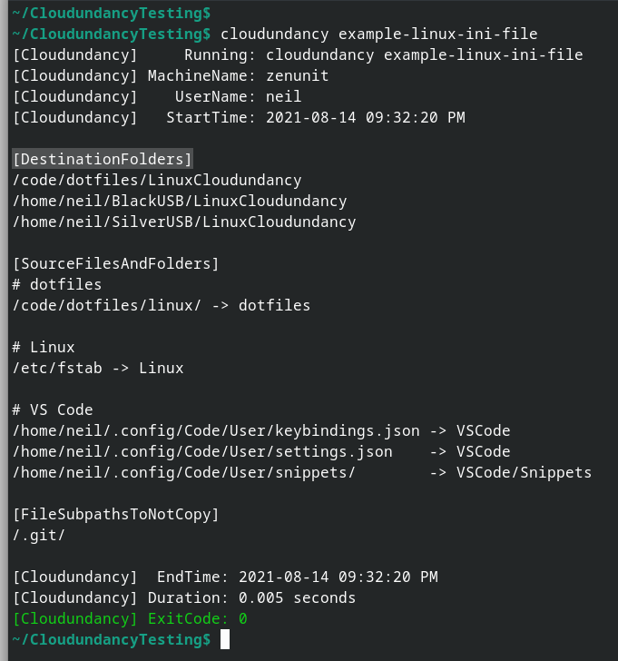
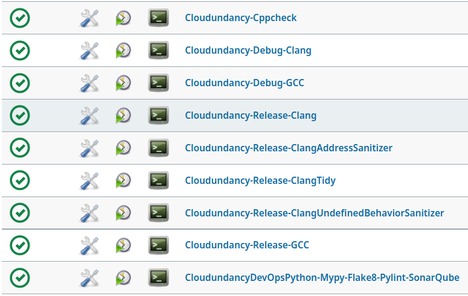
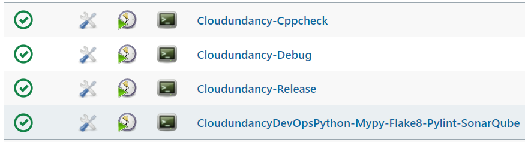

# ☁️ Cloudundancy ☁️

[](https://en.wikipedia.org/wiki/C%2B%2B20)  

Cloudundancy is a cross-platform C++ command line program for quickly copying a configurable list of files and folders to a configurable list of destination folders to achieve cloud-redundant and device-redundant backups of files.

For example, on Windows in a Cloudundancy.ini file, destination folders can be configured to be automatic-cloud-uploading Google Drive and Microsoft OneDrive folders `C:\GoogleDrive\CloudundancyBackups` and `C:\OneDrive\CloudundancyBackups`. Double USB backups can also be achieved by adding USB drive paths `E:\CloudundancyBackups` and `F:\CloudundancyBackups` to the Cloudundancy.ini file.

On Linux, a Bash script can be written to run Google Drive command line `drive push` from `~/googledrive` after having run Cloudundancy to copy business-critical files to `~/googledrive`.

|Build Type|Build Status|
|----------|------------|
|GitHub Actions Debug and Release build - ubuntu-latest Clang 11 / GCC 10|[](https://github.com/NeilJustice/Cloudundancy/actions/workflows/build.yml)|
|AppVeyor Debug and Release build - Visual Studio 2019 x64|<a href="https://ci.appveyor.com/project/NeilJustice/Cloudundancy"></a>|
|Codecov.io code coverage for Cloudundancy's C++ and CloudundancyDevOpsPython|[](https://codecov.io/gh/NeilJustice/Cloudundancy)|
|SonarCloud scan of CloudundancyDevOpsPython - the Python code which builds and tests Cloudundancy|[](https://sonarcloud.io/dashboard?id=NeilJustice_Cloudundancy)|

Cloudundancy is rigorously unit tested with <a href="https://github.com/NeilJustice/ZenUnitAndMetalMock">ZenUnit and MetalMock</a>.

* [Cloudundancy command line usage](#cloudundancy-command-line-usage)
* [Cloudundancy program modes](#cloudundancy-program-modes)
   * [example-linux-ini-file](#example-linux-ini-file)
   * [example-windows-ini-file](#example-windows-ini-file)
   * [copy-files-to-multiple-folders](#copy-files-to-multiple-folders)
   * [7zip-files-then-copy-the-7zip-file-to-multiple-folders](#7zip-files-then-copy-the-7zip-file-to-multiple-folders)
* [Cloudundancy code structure as it appears in Visual Studio Code on Linux](#cloudundancy-code-structure-as-it-appears-in-visual-studio-code-on-linux)
* [Cloudundancy code structure as it appears in Visual Studio 2019 on Windows](#cloudundancy-code-structure-as-it-appears-in-visual-studio-2019-on-windows)
* [Linux Jenkins jobs which build, Cppcheck, clang-tidy, AddressSanitize, and UndefinedBehaviorSanitize Cloudundancy's C++ code and Mypy-Flake8-Pylint-SonarQube scan Cloudundancy's CI/CD Python code](#linux-jenkins-jobs-which-build-cppcheck-clang-tidy-addresssanitize-and-undefinedbehaviorsanitize-cloudundancys-c-code-and-mypy-flake8-pylint-sonarqube-scan-cloudundancys-cicd-python-code)
* [Windows Jenkins jobs which build and Cppcheck Cloudundancy's C++ code and Mypy-Flake8-Pylint-SonarQube scan Cloudundancy's CI/CD Python code](#windows-jenkins-jobs-which-build-and-cppcheck-cloudundancys-c-code-and-mypy-flake8-pylint-sonarqube-scan-cloudundancys-cicd-python-code)
* [4 steps to build binary cloudundancy on Linux with Clang](#4-steps-to-build-binary-cloudundancy-on-linux-with-clang)
* [4 steps to build executable Cloudundancy.exe on Windows with Visual Studio 2019](#4-steps-to-build-executable-cloudundancyexe-on-windows-with-visual-studio-2019)

## Cloudundancy command line usage

```ini
Cloudundancy v0.12.0
Copies configurable file and folder paths to configurable file and folder paths.
For example, on Windows, destination folder paths can be set to C:\GoogleDrive and C:\OneDrive
to achieve cloud-redundant backups by way of automatic cloud uploading.

Usage:
   cloudundancy example-linux-ini-file
   cloudundancy example-windows-ini-file
   cloudundancy copy-files-to-multiple-folders
      --ini-file=<FilePath> [--delete-destination-folders-first]
   cloudundancy 7zip-files-then-copy-the-7zip-file-to-multiple-folders
      --ini-file-to-copy-files-to-7zip-staging-folder=<FilePath>
      --7zip-staging-folder=<FolderPath>
      --ini-file-to-copy-7zip-file-from-staging-folder-to-multiple-folders=<FilePath>
```

## Cloudundancy program modes

### example-linux-ini-file

Cloudundancy program mode `example-linux-ini-file` prints an example Linux Cloudundancy .ini file which shows how to achieve triple backups of files to one GitHub repo folder and two USB drives:



### example-windows-ini-file

Cloudundancy program mode `example-windows-ini-file` prints an example Windows Cloudundancy .ini file which shows how to achieve quintuple backups of files to two automatic cloud-uploading folders (C:\GoogleDrive and C:\OneDrive), one GitHub repo folder (C:\GitHubRepos), and two USB drives (D: and E:).

```
[DestinationFolders]
# Cloud-redundant backups to Google's cloud, Microsoft's cloud, and GitHub's cloud
C:\GoogleDrive\CloudundancyBackups
C:\OneDrive\CloudundancyBackups
C:\GitHubRepos\CloudundancyBackups

# Device-redundant backups to USB drive D: and USB drive E:
D:\CloudundancyBackups
E:\CloudundancyBackups

[SourceFilesAndFolders]
# In the [SourceFilesAndFolders] section, the line format is:
# SourceFileOrFolderPath -> RelativeDestinationFolderPath

# Critical files to backup
C:\CriticalFiles\KeePassFile.kdbx -> .
C:\CriticalFiles\PersonalFinancesSpreadsheet.xlsx -> .
C:\VS2019\Common7\IDE\VC\Snippets\1033\Visual C++\C++Snippets.snippet                              -> Snippets
C:\VS2019\Common7\IDE\Extensions\Microsoft\Python\Core\Snippets\1033\Python\PythonSnippets.snippet -> Snippets
C:\VS2019\VC#\Snippets\1033\Visual C#\CSharpSnippets.snippet                                       -> Snippets

# Critical folders to backup
# Source folder paths ending in a '\' or '/' character are interpretted as folders instead of files
C:\Users\UserName\Documents\WindowsPowerShell\ -> PowerShell

[FileSubpathsToNotCopy]
# In the [FileSubpathsToNotCopy] section, case-sensitive file path substrings can be listed one per line
# PowerShell Modules folder to not backup because PowerShell modules can be easily reinstalled
PowerShell\Modules\
```

### copy-files-to-multiple-folders

```ini
cloudundancy copy-files-to-multiple-folders
   --ini-file=<CloudundancyIniFilePath> [--delete-destination-folders-first]
```

Cloudundancy program mode `copy-files-to-multiple-folders` copies files and folders listed in a Cloudundancy.ini file to multiple destination folders.

Most notably, destination folders can be configured to automatic cloud-uploading Google Drive and Microsoft OneDrive folders on Windows for achieving cloud-redundant file backups.

Console output on Linux for `cloudundancy copy-files-to-multiple-folders --ini-file=/code/dotfiles/LinuxCloudundancy.ini --delete-destination-folders-first`:


As an example on Windows, imagine the following folder structure at `C:\CloudundancyTesting`:


With `Cloudundancy.ini` being as follows to instruct Cloudundancy to backup business-critical files and folders present in `C:\CloudundancyTesting`, except for file paths containing case-sensitive substrings `ignored_filename` or `.ignored_file_extension`:


Console output for `Cloudundancy.exe copy-files-to-multiple-folders --ini-file=C:\CloudundancyTesting\Cloudundancy.ini --delete-destination-folders-first`:


Resulting contents of `C:\CloudundancyTesting\GoogleDrive`:


Resulting contents of `C:\CloudundancyTesting\OneDrive`:


Resulting contents of `C:\CloudundancyTesting\GoogleDrive\Cloudundancy.log`:


Resulting contents of `C:\CloudundancyTesting\OneDrive\Cloudundancy.log`:


### 7zip-files-then-copy-the-7zip-file-to-multiple-folders

```ini
cloudundancy 7zip-files-then-copy-the-7zip-file-to-multiple-folders
   --ini-file-to-copy-files-to-7zip-staging-folder=<CloudundancyIniFilePath>
   --7zip-staging-folder=<FolderPath>
   --ini-file-to-copy-7zip-file-from-staging-folder-to-multiple-folders=<CloudundancyIniFilePath>
```

Program mode `7zip-files-then-copy-the-7zip-file-to-multiple-folders` performs the following steps to backup files to a .7z file and then copy the .7z file to multiple destination folders:

1. Deletes the 7-Zip staging folder specified with `--7zip-staging-folder`.
2. Copies `[SourceFilesAndFolders]` listed in Cloudundancy.ini file `--ini-file-to-copy-files-to-7zip-staging-folder` to the 7-Zip staging folder.

Example `--ini-file-to-copy-files-to-7zip-staging-folder`:


3. Runs executable `7z` on the PATH to 7-Zip the contents of `--7zip-staging-folder` to a .7z file written to folder `<7ZipStagingFolder>\7ZipFile` with file name `CloudundancyBackup_YYYY-MM-DDTHH-MM-SS.7z`.
4. Copies the `.7z` file to `[DestinationFolders]` listed in Cloudundancy.ini file `--ini-file-to-copy-7zip-file-from-staging-folder-to-multiple-folders`.

Example `--ini-file-to-copy-7zip-file-from-staging-folder-to-multiple-folders`:


As an example, consider the following folder structure:


Console output on Windows for the following Cloudundancy 7-zip command line:

```ini
Cloudundancy.exe 7zip-files-then-copy-the-7zip-file-to-multiple-folders
   --ini-file-to-copy-files-to-7zip-staging-folder=C:\Cloudundancy7ZipTesting\CodeFolderTo7ZipStagingFolderCopyingStep.ini
   --7zip-staging-folder=C:\Cloudundancy7ZipTesting\7ZipStagingFolder
   --ini-file-to-copy-7zip-file-from-staging-folder-to-multiple-folders=C:\Cloudundancy7ZipTesting\7ZipFileToGoogleDriveAndOneDriveCopyingStep.ini
```


GitHub repos successfully 7-Zipped and copied to a Google Drive folder:


GitHub repos successfully 7-Zipped and copied to a OneDrive folder:


## Cloudundancy code structure as it appears in Visual Studio Code on Linux

Shown in this screenshot is the call to `_cloudundancyIniFileReader->ReadIniFile(iniFilePath`) for reading the Cloudundancy .ini file:


## Cloudundancy code structure as it appears in Visual Studio 2019 on Windows

Shown in this screenshot is function `CloudundancyArgsParser::ParseStringArgs` which uses the excellent single-header command line arguments parsing  library [docopt.cpp](https://github.com/docopt/docopt.cpp) to parse Cloudundancy's command line arguments:


## Linux Jenkins jobs which build, Cppcheck, clang-tidy, AddressSanitize, and UndefinedBehaviorSanitize Cloudundancy's C++ code and Mypy-Flake8-Pylint-SonarQube scan Cloudundancy's CI/CD Python code

A Jenkins Blue Ocean build pipeline builds the following Cloudundancy Jenkins jobs on Fedora 34:



## Windows Jenkins jobs which build and Cppcheck Cloudundancy's C++ code and Mypy-Flake8-Pylint-SonarQube scan Cloudundancy's CI/CD Python code

A Jenkins Blue Ocean build pipeline builds the following Cloudundancy Jenkins jobs on Windows 10:



## 4 steps to build binary cloudundancy on Linux with Clang

```bash
git clone https://github.com/NeilJustice/Cloudundancy
cd Cloudundancy && mkdir Release && cd Release
CXX=clang++ cmake .. -DCMAKE_BUILD_TYPE=Release
sudo cmake --build . --target install
```

Resulting binary `/usr/local/bin/cloudundancy`:


## 4 steps to build executable Cloudundancy.exe on Windows with Visual Studio 2019

```powershell
git clone https://github.com/NeilJustice/Cloudundancy
cd Cloudundancy
cmake . -G"Visual Studio 16 2019" -A x64 -DCMAKE_INSTALL_PREFIX=C:\bin
cmake --build . --config Release --target install
```

Resulting executable `C:\bin\Cloudundancy.exe`:


